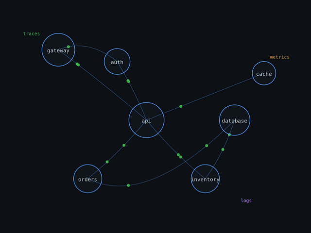

  

<h1 align="center">OpenTelemetry Koans</h1>

  <em>A system ran for a thousand days without error. 
  On the thousand-and-first day, it failed. 
  The developer asked, "When did this begin?" 
  But the system had never learned to speak.</em>

  <a href="https://otel.mreider.com">otel.mreider.com</a>

---

Twenty interactive exercises. No backend. No prior knowledge required.

Each koan presents a problem. You investigate, discover, and name the concept yourself — metrics, traces, logs, spans, collectors, pipelines, sampling, correlation — one idea at a time, in order.

Built for product managers and anyone who works near distributed systems but hasn't yet listened to them.

Desktop only. Headphones recommended.

---

Music: [All the Light](https://futurezen.bandcamp.com/track/all-the-light) by Future Zen (CC-BY-SA 4.0)
